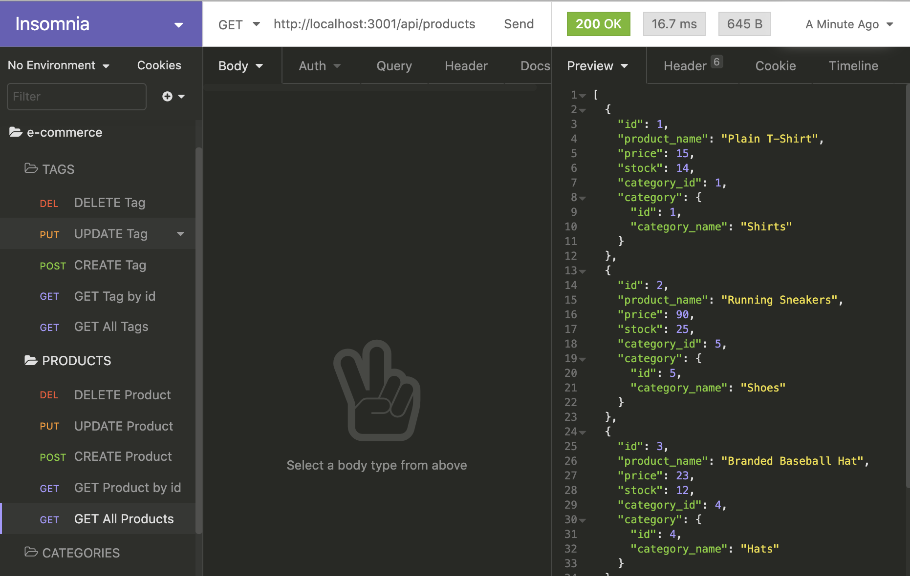

# E-Commerce Back End 

## Description 
E-Commerce Back End is an MySQL and Express.js-driven application that enables database interaction and editing via npm package Sequelize. 

## Table of Contents
* [Installation](#installation) 
* [Usage](#usage) 
* [License](#license) 
* [Contributing](#contributing)
* [Tests](#tests)  
* [Questions](#questions)

### Installation
  Clone or fork the code from the E-Commerce Back End repository on GitHub. Open the code in a standard code editing application, such as VS Code. Install npm packages mysql2, express, dotenv, and sequelize from the terminal. 
### Usage
 Open an integrated terminal and type the command "node index.js." Use an API REST client application such as Insomnia Core to interact with the database. 
### License
  MIT
### Contributing
E-Commerce Back End is an open source project, and anyone is encouraged to contribute by cloning or forking the code and working to improve its function and versatility.

### Tests
Try searching for routes or parameters that don't exist.  

### Questions
    
##### Interested in other projects from this developer? Visit the following GitHub profile:
https://github.com/jeffwjohn
    
##### Send any questions to the following email address:
jeffwjohn@yahoo.com

##### View a demonstration video at the following link:
https://drive.google.com/file/d/11p41Uy8PNtt6pE-K_KIggyy0VqMIwsGC/view